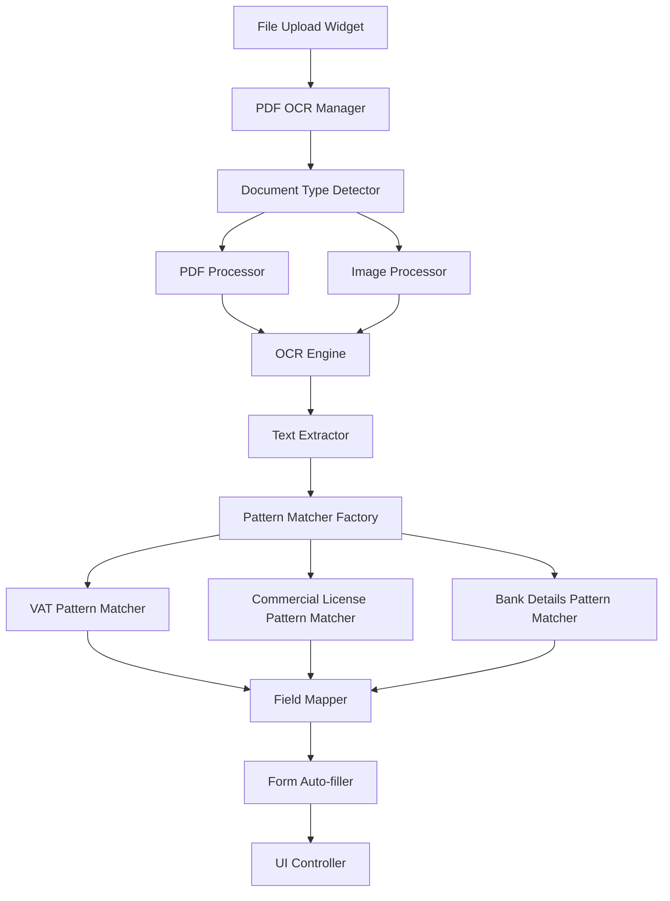

# Design Document

## Overview

The PDF OCR Auto-fill feature will enhance the contractor registration process by automatically extracting text from uploaded PDF documents and populating relevant form fields. This system will build upon the existing OCR services architecture while introducing a unified, modular approach for handling different document types.

The solution leverages Google ML Kit for text recognition, implements document-specific regex patterns for data extraction, and provides a seamless user experience with visual feedback during processing.

## Architecture

### High-Level Architecture



### Service Layer Architecture

The system follows a layered architecture with clear separation of concerns:

1. **Presentation Layer**: UI components and controllers
2. **Service Layer**: OCR processing and business logic
3. **Data Layer**: Pattern matching and field extraction
4. **Infrastructure Layer**: File handling and ML Kit integration

## Components and Interfaces

### 1. Core OCR Manager

```dart
abstract class IOcrManager {
  Future<OcrResult> processDocument(String filePath, DocumentType type);
  Future<bool> validateDocument(String filePath);
  void dispose();
}

class PdfOcrManager implements IOcrManager {
  final ITextExtractor _textExtractor;
  final IPatternMatcherFactory _patternFactory;
  final IFieldMapper _fieldMapper;
}
```

### 2. Document Processing Pipeline

```dart
abstract class IDocumentProcessor {
  Future<String> extractText(String filePath);
  bool canProcess(String filePath);
}

class PdfDocumentProcessor implements IDocumentProcessor {
  Future<String> extractText(String filePath);
}

class ImageDocumentProcessor implements IDocumentProcessor {
  Future<String> extractText(String filePath);
}
```

### 3. Pattern Matching System

```dart
abstract class IPatternMatcher {
  Map<String, String?> extractFields(String text);
  bool validate(Map<String, String?> fields);
  DocumentType get documentType;
}

class VatCertificatePatternMatcher implements IPatternMatcher {
  static const Map<String, RegExp> patterns = {
    'firmName': RegExp(r'(?:company|firm|name)[\s:]+(.+)', caseSensitive: false),
    'taxNumber': RegExp(r'(?:trn|tax registration)[\s:]+(\d{15})', caseSensitive: false),
    'registeredAddress': RegExp(r'(?:address|location)[\s:]+(.+)', caseSensitive: false),
    'effectiveDate': RegExp(r'(?:effective date|issue date)[\s:]+(.+)', caseSensitive: false),
  };
}
```

### 4. Field Mapping and Auto-fill

```dart
abstract class IFieldMapper {
  Map<String, TextEditingController> mapToControllers(
    Map<String, String?> extractedData,
    Map<String, TextEditingController> controllers,
  );
}

class ContractorFieldMapper implements IFieldMapper {
  final Map<String, String> fieldMappings = {
    'firmName': '_firmNameController',
    'taxNumber': '_taxNumberController',
    'registeredAddress': '_registeredAddressController',
    'effectiveDate': '_effectiveVatDateController',
  };
}
```

## Data Models

### 1. OCR Result Model

```dart
class OcrResult {
  final bool success;
  final Map<String, String?> extractedFields;
  final List<String> populatedFields;
  final String? errorMessage;
  final DocumentType documentType;
  final double confidence;

  const OcrResult({
    required this.success,
    required this.extractedFields,
    required this.populatedFields,
    this.errorMessage,
    required this.documentType,
    required this.confidence,
  });
}
```

### 2. Document Type Enumeration

```dart
enum DocumentType {
  vatCertificate,
  commercialLicense,
  bankStatement,
  contractorCertificate,
  unknown;

  String get displayName {
    switch (this) {
      case DocumentType.vatCertificate:
        return 'VAT Certificate';
      case DocumentType.commercialLicense:
        return 'Commercial License';
      case DocumentType.bankStatement:
        return 'Bank Statement';
      case DocumentType.contractorCertificate:
        return 'Contractor Certificate';
      case DocumentType.unknown:
        return 'Unknown Document';
    }
  }
}
```

### 3. Processing State Model

```dart
class OcrProcessingState {
  final bool isProcessing;
  final String? statusMessage;
  final double progress;
  final DocumentType? detectedType;

  const OcrProcessingState({
    required this.isProcessing,
    this.statusMessage,
    required this.progress,
    this.detectedType,
  });
}
```

## Error Handling

### 1. Exception Hierarchy

```dart
abstract class OcrException implements Exception {
  final String message;
  final String? details;
  
  const OcrException(this.message, [this.details]);
}

class DocumentProcessingException extends OcrException {
  const DocumentProcessingException(String message, [String? details]) 
    : super(message, details);
}

class PatternMatchingException extends OcrException {
  const PatternMatchingException(String message, [String? details]) 
    : super(message, details);
}

class FileValidationException extends OcrException {
  const FileValidationException(String message, [String? details]) 
    : super(message, details);
}
```

### 2. Error Recovery Strategy

- **Retry Mechanism**: Implement exponential backoff for transient failures
- **Fallback Processing**: Use alternative OCR engines if primary fails
- **Graceful Degradation**: Allow manual form completion if OCR fails
- **User Feedback**: Provide clear error messages and recovery options

## Testing Strategy

### 1. Unit Testing

- **Pattern Matching Tests**: Validate regex patterns with sample documents
- **Field Mapping Tests**: Ensure correct controller mapping
- **Document Processing Tests**: Test PDF and image processing pipelines
- **Error Handling Tests**: Verify exception handling and recovery

### 2. Integration Testing

- **End-to-End OCR Flow**: Test complete document processing pipeline
- **UI Integration Tests**: Verify form auto-fill functionality
- **File Upload Integration**: Test with various file formats and sizes
- **Performance Tests**: Measure processing time and memory usage

### 3. Test Data Strategy

```dart
class TestDocumentFactory {
  static String createVatCertificatePdf(Map<String, String> fields);
  static String createCommercialLicensePdf(Map<String, String> fields);
  static String createBankStatementPdf(Map<String, String> fields);
  static File createCorruptedPdf();
  static File createLargeDocument();
}
```

## Performance Considerations

### 1. Optimization Strategies

- **Lazy Loading**: Load OCR engines only when needed
- **Caching**: Cache processed results for re-scan operations
- **Background Processing**: Use isolates for CPU-intensive OCR operations
- **Memory Management**: Dispose of resources properly to prevent leaks

### 2. Mobile-Specific Optimizations

- **Image Compression**: Reduce image size before OCR processing
- **Progressive Processing**: Show progress indicators for long operations
- **Battery Optimization**: Minimize CPU usage during processing
- **Network Efficiency**: Optimize API calls for external OCR services

## Security Considerations

### 1. Data Protection

- **Temporary File Cleanup**: Automatically delete processed images
- **Memory Clearing**: Clear sensitive data from memory after processing
- **Access Control**: Validate file permissions before processing
- **Data Validation**: Sanitize extracted text before form population

### 2. File Security

- **File Type Validation**: Verify file extensions and MIME types
- **Size Limits**: Enforce maximum file size restrictions
- **Malware Protection**: Scan uploaded files for security threats
- **Path Traversal Prevention**: Validate file paths to prevent directory traversal

## Integration Points

### 1. Existing Services Integration

The new OCR system will integrate with existing services:

- **BankDetailsOcrService**: Extend for unified pattern matching
- **VatCertificateOcrService**: Refactor to use new architecture
- **CommercialLicenceOcrService**: Integrate with pattern factory
- **FileUploadWidget**: Add OCR trigger functionality

### 2. UI Integration Points

```dart
class FileUploadWidget extends StatefulWidget {
  final Function(OcrResult)? onOcrComplete;
  final bool enableOcr;
  final DocumentType? expectedDocumentType;
  
  // Existing properties...
}
```

### 3. State Management Integration

```dart
class ContractorRegistrationController extends ChangeNotifier {
  OcrProcessingState _ocrState = const OcrProcessingState(isProcessing: false, progress: 0.0);
  
  Future<void> processUploadedDocument(String filePath, DocumentType type) async {
    // OCR processing logic
  }
  
  void _updateOcrState(OcrProcessingState newState) {
    _ocrState = newState;
    notifyListeners();
  }
}
```

## Migration Strategy

### 1. Backward Compatibility

- Maintain existing OCR service interfaces during transition
- Implement feature flags for gradual rollout
- Provide fallback to legacy services if new system fails

### 2. Phased Implementation

1. **Phase 1**: Implement core OCR manager and pattern matching
2. **Phase 2**: Integrate with existing VAT certificate processing
3. **Phase 3**: Add commercial license and bank statement support
4. **Phase 4**: Implement UI enhancements and user feedback
5. **Phase 5**: Performance optimization and testing

## Monitoring and Analytics

### 1. Performance Metrics

- OCR processing time per document type
- Success rate of field extraction
- User satisfaction with auto-fill accuracy
- Error frequency and types

### 2. Logging Strategy

```dart
class OcrLogger {
  static void logProcessingStart(String documentType, String fileSize);
  static void logProcessingComplete(String documentType, Duration processingTime, int fieldsExtracted);
  static void logProcessingError(String documentType, String error, String stackTrace);
  static void logUserFeedback(String documentType, bool userAcceptedAutoFill);
}
```

This design provides a robust, scalable foundation for implementing PDF OCR auto-fill functionality while maintaining compatibility with existing systems and ensuring optimal user experience.